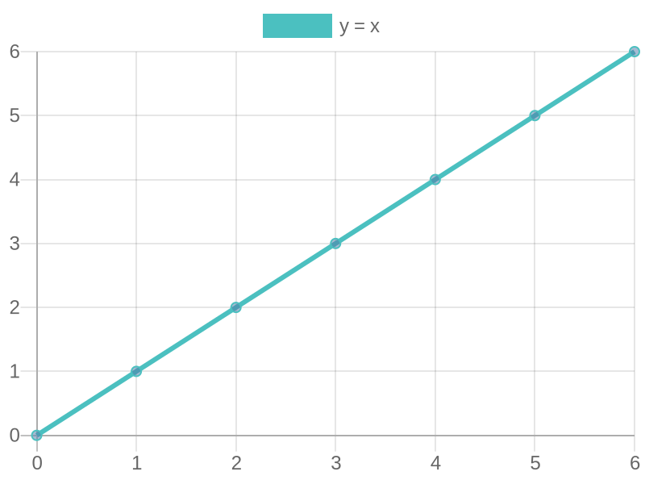
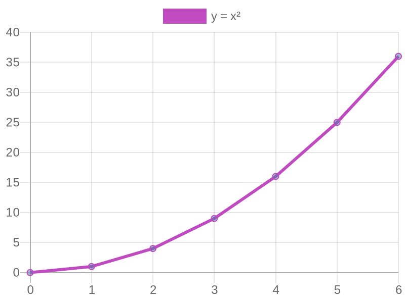
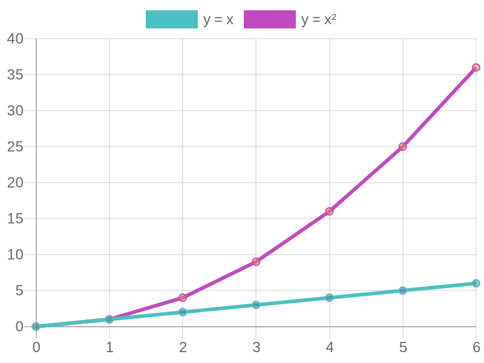

# LeanPlot

<p align="center">
  
  
  
</p>

LeanPlot turns Lean 4 code into **interactive, React-powered charts that render right inside VS Code's infoview**.  Built on top of [ProofWidgets4](https://github.com/leanprover-community/ProofWidgets4) and [Recharts](https://recharts.org), it lets you inspect functions and data visually while you prove.

---

## ✨ Key features

* **One-liner helpers `lineChart` / `scatterChart`** – produce a plot from a Lean function or an array of points with zero configuration.
* **Composable graphics algebra** – overlay or stack plots with the `+` operator or `PlotSpec.stack`.
* **Grammar of Graphics DSL** – build complex visualizations using a fluent builder pattern inspired by ggplot2.
* **Faceting support** – lay out multiple sub‐plots in a grid via `LeanPlot.Faceting.facetGrid`.
* **Log/linear scale support** – visualize exponential growth and power laws with logarithmic axes.
* **Data transformations** – apply scales (log, sqrt, power, symlog), normalize data, and smooth with moving averages via `LeanPlot.Transform`.
* **Advanced plot composition** – create subplot grids, vertically stacked plots with shared axes, and apply consistent styling across multiple plots with `LeanPlot.PlotComposition`.
* **Layered API** – start at the high level and drop down to `PlotSpec` or the raw Recharts props whenever you need fine-grained control.
* **Sampling utilities** – `sample` / `sampleMany` uniformly sample any codomain that implements `[ToFloat]`.
* **Demo gallery** – ready-to-run examples under `LeanPlot/Demos` (linear, quadratic, cubic, overlay, stack, bar, area, log scales, grammar of graphics, data transformations…).

---

## 🏗 Installation

Add LeanPlot to your project's `lakefile.toml`:

```toml
[[require]]
name = "LeanPlot"
url = "https://github.com/alok/LeanPlot"
```

or to `lakefile.lean`:

```lean
require LeanPlot from git
  "https://github.com/alok/LeanPlot" @ "main"
```

Then fetch and build the deps:

```bash
lake update
lake build
```

(You'll need `node`/`npm` on your PATH – ProofWidgets handles the bundling automatically.)

---

## 🚀 Quick start

Create a new `.lean` file, open the infoview, and paste:

```lean
import LeanPlot.Algebra

open LeanPlot.Algebra

#plot (
  line "y"  (fun x : Float ↦ x) +
  line "y²" (fun x ↦ x*x)
)
```

Hover over `#plot` and you'll see an interactive chart with two series.

### Grammar of Graphics DSL

For more complex visualizations, use the Grammar of Graphics DSL:

```lean
import LeanPlot.GrammarOfGraphics
import LeanPlot.Core

open LeanPlot.GrammarOfGraphics

#html (
  plot (fun x => x * x)
    |> fun p => PlotBuilder.withTitle p "Quadratic Function"
    |> fun p => PlotBuilder.withSize p 500 400
    |> fun p => PlotBuilder.logY p 10.0  -- Log scale on Y axis
    |> PlotBuilder.build
    |> Render.render
)
```

---

## 🏟 Demo gallery

* `LeanPlot.Demos.LinearDemo`     – `y = x`
* `LeanPlot.Demos.QuadraticDemo`  – `y = x²`
* `LeanPlot.Demos.CubicDemo`      – `y = x³`
* `LeanPlot.Demos.OverlayDemo`    – overlay of `y = x` and `y = x²`
* `LeanPlot.Demos.StackDemo`      – stacking via `+` and `PlotSpec.stack`
* `LeanPlot.Demos.LogScaleDemo`   – exponential growth with linear and log scales
* `LeanPlot.Demos.GrammarDemo`    – showcase of the Grammar of Graphics DSL
* `LeanPlot.Demos.TransformDemo`  – data transformations: scales, normalization, smoothing
* `LeanPlot.Demos.FacetDemo`      – faceting layout with a grid of small multiples

Open any demo and hover the `#html` command to run it.

---

## 🛠 Development

```bash
just build       # lake build
just lint        # run linter
just docs        # regenerate docs
just check-docs  # check for missing documentation
just demos       # list all demos
just watch       # watch for changes and rebuild
```

Contributions welcome – check `TODO.md` and open an issue or PR.

## 📄 License

LeanPlot is released under the Apache License 2.0; see `LICENSE` for details.
